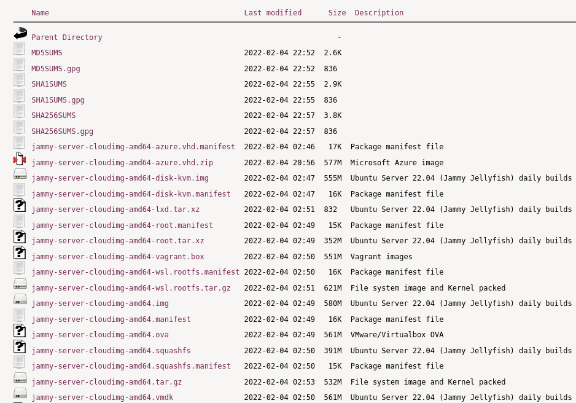

# Cloud Operating System Alternatives

Editors: **Kaan Keskin**

Date: March 2022

Available at: https://github.com/kaan-keskin/cloud-native-concepts

**Resources:**

> - Virtualization Essentials - Matthew Portnoy
> - Server Virtualization For Dummies - Lawrence C. Miller
> - Wikipedia - www.wikipedia.com

**LEGAL NOTICE: This document is created for educational purposes, and it can not be used for any commercial intentions. If you find this document useful in any means please support the original authors for ethical reasons.**

## VM Linux OS Alternatives

- Ubuntu Cloud Images
- CoreOS

### Ubuntu Virtualization

Virtualization is being adopted in many different environments and situations. If you are a developer, virtualization can provide you with a contained environment where you can safely do almost any sort of development safe from messing up your main working environment. If you are a systems administrator, you can use virtualization to more easily separate your services and move them around based on demand.

The default virtualization technology supported in Ubuntu is KVM. For Intel and AMD hardware KVM requires virtualization extensions. But KVM is also available for IBM Z and LinuxONE, IBM POWER as well as for ARM64.
Qemu is part of the KVM experience being the userspace backend for it, but it also can be used for hardware without virtualization extensions by using its TCG mode.

While virtualization is in many ways similar to containers those are different and implemented via other solutions like LXD, systemd-nspawn, containerd and others.

#### Qemu

Qemu is a machine emulator that can run operating systems and programs for one machine on a different machine. Mostly it is not used as emulator but as virtualizer in collaboration with KVM kernel components. In that case it utilizes the virtualization technology of the hardware to virtualize guests.

While qemu has a command line interface and a monitor to interact with running guests those is rarely used that way for other means than development purposes. Libvirt provides an abstraction from specific versions and hypervisors and encapsulates some workarounds and best practices.

### Ubuntu Cloud Images

**Ubuntu Cloud Images** are the official Ubuntu images that have been customised by Canonical to run on public clouds that provide Ubuntu Certified Images, Openstack, LXD and more.

Canonical produces a variety of cloud-specific images, which are available directly on the cloud’s themselves as well as on https://cloud-images.ubuntu.com.

#### Private Clouds

On cloud-images.ubuntu.com, users can find standard and minimal images for the following:

    Hyper-V
    KVM
    OpenStack
    Vagrant
    VMware

#### Release Support

Cloud images are published and supported throughout the lifecycle of an Ubuntu release. During this time images can receive all published security updates and bug fixes.

For users wanting to upgrade from one release to the next, the recommended path is to launch a new image with the desired release and then migrate whatever workload or data to the new image.

Some cloud image customization must be applied during image creation, these would be missing if an in-place upgrade were performed. For that reason in-place upgrades of cloud images are not recommended.

### Customising Cloud Instances

#### cloud-init

Cloud images are operating system templates and every instance starts out as an identical clone of every other instance. It is the user data that gives every cloud instance its personality and cloud-init is the tool that applies user data to your instances automatically.

Use cloud-init to configure:
- Setting a default locale
- Setting the hostname
- Generating and setting up SSH private keys
- Setting up ephemeral mount points 

#### Works with many popular operating systems

While cloud-init started life in Ubuntu, it is now available for most major Linux and FreeBSD operating systems. For cloud image providers, then cloud-init handles many of the differences between cloud vendors automatically — for example, the official Ubuntu cloud images are identical across all public and private clouds.
