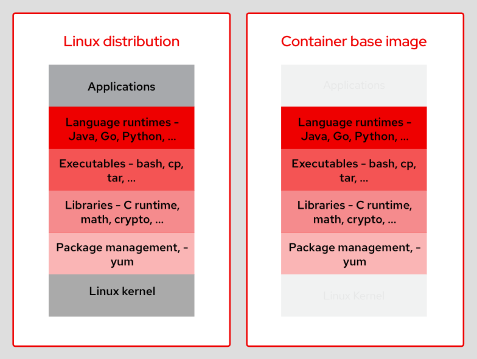

# Container Base Images

Editors: **Kaan Keskin**

Date: March 2022

Available at: https://github.com/kaan-keskin/cloud-native-concepts

**Resources:**

> - Red Hat Universal Base Images Booklet
> - Managed base images - Google Cloud Documentation - https://cloud.google.com/artifact-management/docs/managed-base-images
> - Wikipedia - www.wikipedia.com

**LEGAL NOTICE: This document is created for educational purposes, and it can not be used for any commercial intentions. If you find this document useful in any means please support the original authors for ethical reasons.**

## Introduction

Containers have provided great benefits for developing and operating applications and microservices. Application code, language runtimes, and operating system (OS) components are merged into a single delivery mechanism, allowing an application to run in production with the identical runtime components with which it was developed. Testing and support are streamlined and many of the situations where code doesn’t work correctly on a system other than the developer’s are eliminated.

To satisfy application runtime dependencies, containers bundle a number of the components from a traditional OS. The foundation for building applications in containers is a container base image. A container base image typically includes a number of pre-installed packages and additional packages that can be easily installed with a package manager like YUM or DNF. The base images and their packages are essentially a Linux OS distribution that has been stripped down to the bare minimum.

Selecting, operating, and maintaining operating systems has long been the responsibility of IT. Through experience, IT organizations have learned that high standards for operating systems are necessary to maintain an environment that is stable, reliable, and secure. To reduce complexity and operational drag, IT organizations develop Standard Operating Environments (SOEs) that include an identical OS base image for all of the machines they operate. For updates, security advisories, and help when things go wrong, IT organizations maintain a relationship with an OS vendor that provides support (reliability, stability, and high-quality, long-term support).

It’s important to consider that the full stack on which a containerized application depends includes the host system’s OS as well as the OS components inside the container. With containers, the control over what OS components run inside of the container are shifted from IT to the container developer.

Just as a mature IT organization would exercise control over which OS versions run on their hardware, they need to track what container base images are used to run business-critical applications on their hardware. IT usually still has the responsibility for making sure the application runs reliably.

Containers are an extension of the OS environment. Therefore, containers should be treated as part of a SOE. This is critical when something goes wrong and support is needed that only an OS vendor can provide.

## What is a container base image?

Linux containers offer a lighter-weight version of the Linux OS that allows an application and its dependencies, like OS and language libraries, to be packaged into an isolated portable environment that can easily be distributed. The lighter-weight aspect is that a single Linux kernel is shared between the host system and any containers running on that host. The isolation is in part because each container has its own virtual filesystem. The files available inside a container are a result of packaging those files into one or more container images.

To run almost anything inside a container there needs to be a number of OS-dependent files inside the containers:

- Dynamically loadable libraries in **/lib** and **/usr/lib**, like the C runtime, math, threading, and cryptography libraries.
- OS configuration files in **/etc**, including network and timezone information.
- Miscellaneous shared OS files in **/usr/share**.
- Writable space for various temporary and transient files in **/tmp** and **/var**.

You might not be aware that your application depends on all of these files. Unless an application is a statically linked binary, it uses a number of dynamically loaded libraries, starting with the C runtime library (often glibc) that provides an interface to the Linux kernel’s system calls. Even if your application is written in Java or Python, rather than C, the Java Virtual Machine and Python interpreter that runs your code uses the C runtime library to perform system calls and interact with the system.

Most libraries, including the C runtime library, are built as shared objects to save disk space and memory. Rather than making a copy of them in each executable program, they are dynamically loaded at run time. The library .so files need to be available in the file system when the executable program runs.

The files that make up the OS are often referred to as the userland. Everything that runs above the kernel is considered the user space. If it helps to remember userland, think of **/usr** (pronounced user) where the bulk of the OS files reside. You could say that a Linux distribution is essentially a Linux kernel and a userland packaged in some easily consumable form.

When creating a container, to avoid populating all of the userland files from scratch, a container base image is the most common starting point. Container base images are the files from a Linux distribution that are stripped down to the bare minimum to support running an application. Figure below compares container base image components to a Linux distribution.



Container base images are essentially Linux distributions that are stripped down to the bare minimum. They include a subset of files from
/bin, /etc, /lib, and /usr that are necessary for a typical application to run on Linux.

A base image is one of the simplest types of images, but you will find a lot of definitions. Sometimes users will refer to corporate standard build, or even an application image as the “base image.”  Technically this is not a base image. These are Intermediate images.

Simply put, a base image is an image that has no parent layer. Typically, a base image contains a fresh copy of an operating system. Base images normally include the tools (yum, rpm, apt-get, dnf, microdnf) necessary to install packages / make updates to the image over time. While base images can be “hand crafted”, in practice they are typically produced and published by open source projects (like Debian, Fedora or CentOS) and vendors (like Red Hat). The provenance of base images is critical for security. In short, the sole purpose of a base image is to provide a starting place for creating your derivative images. 

When using a Dockerfile/Containerfile, the choice of which base image you are using is explicit:

```Dockerfile
FROM registry.access.redhat.com/rhel7-atomic
```

Most container-based development starts with a base image and layers on top of it the necessary libraries, binaries, and configuration files necessary to run an application. The base image is the starting point for most container-based development workflows.

Most base images are basic or minimal Linux distributions: Debian, Ubuntu, Redhat, Centos, or Alpine. Developers usually consume these images directly from Docker Hub, or other sources. There are official providers along with a wide variety of other downstream repackagers that layer software to meet customer needs.

Developers, rather than IT, typically choose the OS components that run inside of containers.

## Does it matter what is in the container base image?

Many container images use a base image that is a stripped down version of an existing Linux distribution like Debian, Alpine, Fedora, or CentOS Streams. Most of these base images are maintained by communities. They lack the support that is a critical requirement for many organizations when choosing an OS to run.

For efficiency of moving container images over the network, and to a lesser degree disk space, there is a focus on minimal container size as a primary factor in choosing container base images. While container image size is an easy thing to measure, there are more important factors to consider.

There is a fallacy that the traditional Linux distribution and standard operating environments don’t matter anymore with containers. While containers are Linux distributions stripped down to their bare essentials, they are still an operating system and the quality of a container matters just as much as that of the host operating system.

Software that runs in containers still has a life cycle that needs to be maintained. The need for updates to make sure all software is free of vulnerabilities is just as important as with traditional deployments.

It might be tempting to overlook the bits in container images and think it doesn’t matter where they come from. What is in container images matters, especially to the organizations that have critical software running in containers. In the early days of container deployments, many organizations didn’t have enough experience to realize each container they run becomes another part of their IT landscape that they must maintain. In a sense, the choice of what OS components an organization runs inside container images is delegated to the developer of that containerized application.

The concerns for the contents of container images are similar to choosing an OS or middleware, namely:

- **Provenance**: Do you know the source of the bits in the container image? Are all of the bits actually from the organization you intended it to be?
- **Authenticity**: Can the contents of the container image be verified? Has anything been modified by someone other than the original source?
- **Security**: Can you verify whether the code running in the container is free of any known vulnerabilities? Is the default configuration secure, especially for enterprise use?
- **Quality and reliability**: What testing is performed to make sure the code works correctly and performs well? Updates frequently introduce regressions and can create new vulnerabilities. What testing is done when updates are applied?
- **Performance**: Have there been tests to determine how well the software performs under load on enterprise-grade hardware?
- **Life cycle**: How long will the software in the container be maintained? How long will updates be released to fix bugs and vulnerabilities?
- **Source code availability**: Do you have access to the exact version of the code that was used to produce the container image?
- **Licensing**: Is all of the software actually open source with appropriate licenses that are compatible with your uses? Will you be able to fulfill the requirements for making the source code available for any GPL-licensed software in the base images you use in distributing your software?

As a software developer, many of the above concerns might not seem very important. However, for consumers of your software, especially enterprises with critical business operations depending on software, these concerns are all important. 


## Vendor Provided Base Images

### Google-provided base images

Google provides the following two solutions for base images:

- Google maintains base images for building its own applications. These images are available to users at Google Cloud Marketplace.

- Google provides a secure image pipeline, which is an open source tool that enables you to generate and maintain your own secure base images. You can consume these images from your Google Cloud project.

Google-managed base images have the following advantages:

#### Scanned for known vulnerabilities

They're regularly scanned for known vulnerabilities from the CVE database.

This scan uses the same functionality as Artifact Registry Vulnerability Scanning. When a patch is available for a found vulnerability, Google applies that patch.

#### Built reproducibly

They're built reproducibly so there is a verifiable path from the source code to the binary.

You can verify the image by comparing it to the GitHub source, ensuring that the build has not introduced any flaws.

#### Stored on Google Cloud

They're stored on Google Cloud so you can pull these directly from your environment without having to traverse networks.

### Secure Base Image

All of the out-of-the-box base images suffer from the inability of consumers to audit what is in them. There is no visibility to the sources, build and test processes, or methods of handling the images. Bad actors often add malicious software downstream of the base images. When users consume base images from the public repositories, there is no control of the software supply chain at the root of their application environment.

So, when customers have compliance needs that require auditing every piece of software they run and the environments in which they run, they build something in house. The work to do so takes effort to build and maintain.


