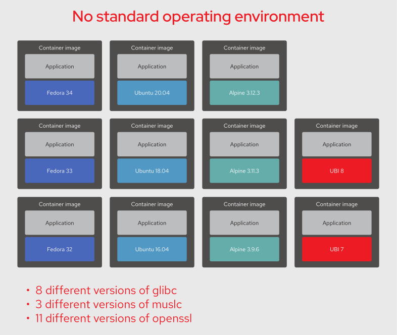
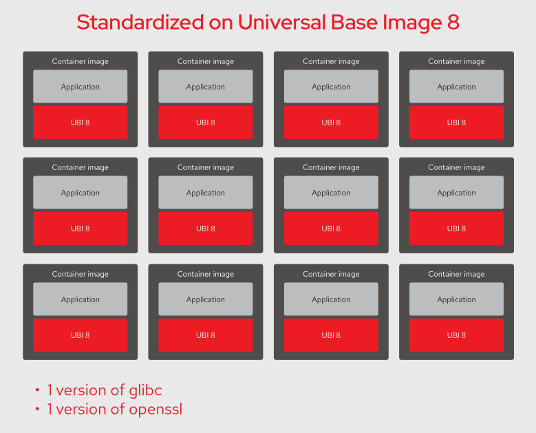

# Container Base Images

Editors: **Kaan Keskin**

Date: March 2022

Available at: https://github.com/kaan-keskin/software-development-life-cycle-and-cloud-native-concepts

**Resources:**

> - Red Hat Universal Base Images Booklet
> - Managed base images - Google Cloud Documentation - https://cloud.google.com/artifact-management/docs/managed-base-images
> - Wikipedia - www.wikipedia.com

**LEGAL NOTICE: This document is created for educational purposes, and it can not be used for any commercial intentions. If you find this document useful in any means please support the original authors for ethical reasons.**

## Introduction

Containers have provided great benefits for developing and operating applications and microservices. Application code, language runtimes, and operating system (OS) components are merged into a single delivery mechanism, allowing an application to run in production with the identical runtime components with which it was developed. Testing and support are streamlined and many of the situations where code doesn’t work correctly on a system other than the developer’s are eliminated.

To satisfy application runtime dependencies, containers bundle a number of the components from a traditional OS. The foundation for building applications in containers is a container base image. A container base image typically includes a number of pre-installed packages and additional packages that can be easily installed with a package manager like YUM or DNF. The base images and their packages are essentially a Linux OS distribution that has been stripped down to the bare minimum.

Selecting, operating, and maintaining operating systems has long been the responsibility of IT. Through experience, IT organizations have learned that high standards for operating systems are necessary to maintain an environment that is stable, reliable, and secure. To reduce complexity and operational drag, IT organizations develop Standard Operating Environments (SOEs) that include an identical OS base image for all of the machines they operate. For updates, security advisories, and help when things go wrong, IT organizations maintain a relationship with an OS vendor that provides support (reliability, stability, and high-quality, long-term support).

It’s important to consider that the full stack on which a containerized application depends includes the host system’s OS as well as the OS components inside the container. With containers, the control over what OS components run inside of the container are shifted from IT to the container developer.

Just as a mature IT organization would exercise control over which OS versions run on their hardware, they need to track what container base images are used to run business-critical applications on their hardware. IT usually still has the responsibility for making sure the application runs reliably.

Containers are an extension of the OS environment. Therefore, containers should be treated as part of a SOE. This is critical when something goes wrong and support is needed that only an OS vendor can provide.

## What is a container base image?

Linux containers offer a lighter-weight version of the Linux OS that allows an application and its dependencies, like OS and language libraries, to be packaged into an isolated portable environment that can easily be distributed. The lighter-weight aspect is that a single Linux kernel is shared between the host system and any containers running on that host. The isolation is in part because each container has its own virtual filesystem. The files available inside a container are a result of packaging those files into one or more container images.

To run almost anything inside a container there needs to be a number of OS-dependent files inside the containers:

- Dynamically loadable libraries in **/lib** and **/usr/lib**, like the C runtime, math, threading, and cryptography libraries.
- OS configuration files in **/etc**, including network and timezone information.
- Miscellaneous shared OS files in **/usr/share**.
- Writable space for various temporary and transient files in **/tmp** and **/var**.

You might not be aware that your application depends on all of these files. Unless an application is a statically linked binary, it uses a number of dynamically loaded libraries, starting with the C runtime library (often glibc) that provides an interface to the Linux kernel’s system calls. Even if your application is written in Java or Python, rather than C, the Java Virtual Machine and Python interpreter that runs your code uses the C runtime library to perform system calls and interact with the system.

Most libraries, including the C runtime library, are built as shared objects to save disk space and memory. Rather than making a copy of them in each executable program, they are dynamically loaded at run time. The library .so files need to be available in the file system when the executable program runs.

The files that make up the OS are often referred to as the userland. Everything that runs above the kernel is considered the user space. If it helps to remember userland, think of **/usr** (pronounced user) where the bulk of the OS files reside. You could say that a Linux distribution is essentially a Linux kernel and a userland packaged in some easily consumable form.

When creating a container, to avoid populating all of the userland files from scratch, a container base image is the most common starting point. Container base images are the files from a Linux distribution that are stripped down to the bare minimum to support running an application. Figure below compares container base image components to a Linux distribution.


Container base images are essentially Linux distributions that are stripped down to the bare minimum. They include a subset of files from
/bin, /etc, /lib, and /usr that are necessary for a typical application to run on Linux.

A base image is one of the simplest types of images, but you will find a lot of definitions. Sometimes users will refer to corporate standard build, or even an application image as the “base image.”  Technically this is not a base image. These are Intermediate images.

Simply put, a base image is an image that has no parent layer. Typically, a base image contains a fresh copy of an operating system. Base images normally include the tools (yum, rpm, apt-get, dnf, microdnf) necessary to install packages / make updates to the image over time. While base images can be “hand crafted”, in practice they are typically produced and published by open source projects (like Debian, Fedora or CentOS) and vendors (like Red Hat). The provenance of base images is critical for security. In short, the sole purpose of a base image is to provide a starting place for creating your derivative images. 

When using a Dockerfile/Containerfile, the choice of which base image you are using is explicit:

```Dockerfile
FROM registry.access.redhat.com/rhel7-atomic
```

Most container-based development starts with a base image and layers on top of it the necessary libraries, binaries, and configuration files necessary to run an application. The base image is the starting point for most container-based development workflows.

Most base images are basic or minimal Linux distributions: Debian, Ubuntu, Redhat, Centos, or Alpine. Developers usually consume these images directly from Docker Hub, or other sources. There are official providers along with a wide variety of other downstream repackagers that layer software to meet customer needs.

Developers, rather than IT, typically choose the OS components that run inside of containers.

## Does it matter what is in the container base image?

Many container images use a base image that is a stripped down version of an existing Linux distribution like Debian, Alpine, Fedora, or CentOS Streams. Most of these base images are maintained by communities. They lack the support that is a critical requirement for many organizations when choosing an OS to run.

For efficiency of moving container images over the network, and to a lesser degree disk space, there is a focus on minimal container size as a primary factor in choosing container base images. While container image size is an easy thing to measure, there are more important factors to consider.

There is a fallacy that the traditional Linux distribution and standard operating environments don’t matter anymore with containers. While containers are Linux distributions stripped down to their bare essentials, they are still an operating system and the quality of a container matters just as much as that of the host operating system.

Software that runs in containers still has a life cycle that needs to be maintained. The need for updates to make sure all software is free of vulnerabilities is just as important as with traditional deployments.

It might be tempting to overlook the bits in container images and think it doesn’t matter where they come from. What is in container images matters, especially to the organizations that have critical software running in containers. In the early days of container deployments, many organizations didn’t have enough experience to realize each container they run becomes another part of their IT landscape that they must maintain. In a sense, the choice of what OS components an organization runs inside container images is delegated to the developer of that containerized application.

The concerns for the contents of container images are similar to choosing an OS or middleware, namely:

- **Provenance**: Do you know the source of the bits in the container image? Are all of the bits actually from the organization you intended it to be?
- **Authenticity**: Can the contents of the container image be verified? Has anything been modified by someone other than the original source?
- **Security**: Can you verify whether the code running in the container is free of any known vulnerabilities? Is the default configuration secure, especially for enterprise use?
- **Quality and reliability**: What testing is performed to make sure the code works correctly and performs well? Updates frequently introduce regressions and can create new vulnerabilities. What testing is done when updates are applied?
- **Performance**: Have there been tests to determine how well the software performs under load on enterprise-grade hardware?
- **Life cycle**: How long will the software in the container be maintained? How long will updates be released to fix bugs and vulnerabilities?
- **Source code availability**: Do you have access to the exact version of the code that was used to produce the container image?
- **Licensing**: Is all of the software actually open source with appropriate licenses that are compatible with your uses? Will you be able to fulfill the requirements for making the source code available for any GPL-licensed software in the base images you use in distributing your software?

As a software developer, many of the above concerns might not seem very important. However, for consumers of your software, especially enterprises with critical business operations depending on software, these concerns are all important. 

## Why choosing a source of base images is a strategic decision

### Standard operating environments (SOEs) and containers

Traditional IT organizations have long understood the value of a Standard Operating Environment (SOE). Historically, administrators implemented an SOE as a disk image, kickstart, or virtual machine image for mass deployment within an organization. This reduced operational overhead, fostered automation, increased reliability by reducing variance, and set security controls that increased the overall security posture of an environment.

SOEs often include the base operating system (kernel and user space programs), custom configuration files, standard applications used within an organization, software updates, and service packs. It is far easier to troubleshoot a failed service at 2 a.m. if every server is running the same configuration. Some major advantages of an SOE are reduced cost as well as an increase in agility. The effort to deploy, configure, maintain, support, and manage systems and applications can all be reduced.

Understanding the value of an SOE, a mature IT organization tightly controls the number of different operating systems and OS versions. The ideal number is one, but that isn’t usually feasible, so there are efforts to keep the number as small as possible. The IT organization therefore expends considerable effort to make sure that boxes aren’t added to the network with ad-hoc OS versions and configurations. The notable exception are applications that are delivered as virtual appliances, either in physical hardware form or virtual machines (VMs). If these virtual appliances are supported by a vendor, it can be reasoned that the vendor is responsible for maintaining the OS and all of the rest of the components on the appliance. Therefore the IT organization is not responsible for those virtual boxes.

Through network security scanning, or worse, during the clean up after a security incident, IT organizations learned that there could be vulnerable software running on their virtual appliances. IT organizations found out some vendor’s practices for keeping appliances up-to-date and secure didn’t live up to their expectations. Being ultimately responsible for the security of their own systems and networks, IT organizations learned that they need to manage their vendors. IT needs to verify that their vendor’s have adequate practices and policies for ensuring the security and reliability of the vendor’s appliances/VMs. There is still an OS and other software on appliances and VMs that needs to be maintained.

So what does this have to do with containers? Containers have dramatically improved development, deployment, and maintenance of applications. The ease with which containers can be deployed, and the isolation they offer, simplifies many aspects of IT management. The advent of containers, and to some degree DevOps practices, has led to the notion that traditional IT practices like SOEs and configuration management best practices are no longer relevant.

With containers, it’s easy to think you can use whatever technology you want, wherever you want, whenever you want, without having a negative impact on your IT landscape. While it’s true that containers have a much smaller footprint and therefore have a much smaller surface area that could be vulnerable, they still have the components of a stripped down Linux OS inside. Those components still need to be maintained like traditional OS deployments. However, with containers, the number of versions to track quickly multiplies.

Even in the world of cloud native and containers, a standard operating environment matters. The set of criteria that should be used to evaluate container base images is quite similar to what we’ve always used for Linux distributions.

Evaluate things like security, performance, how long the life cycle is (you need a longer life cycle than you think), how large the ecosystem is, and what organization backs the Linux distribution used.

### The impact of not standardizing container base images

**The version explosion: how many different versions am I running?**

When developers think about building a containerized application, their focus is typically on running a handful of containers. Even if building a big microservices application with dozens or hundreds of containers, the containers likely share a similar heritage, so developers really don’t think about the many versions of similar software that could be in play. To really understand the impact of the decisions developers make, you need to consider the consumers of your software and the IT environments for which they are responsible. Given the benefits containers offer, most IT organizations ultimately wind up running hundreds of container images, while large corporations could easily be running thousands of different images.

To understand their perspective, consider what happens if a critical vulnerability or bug is discovered in a heavily used library like the OpenSSL cryptography library or the C library (glibc). The first task is identifying all the places the vulnerable versions are running. To do that they need to know what version is running on every system, which includes every container.

Without an SOE, or at least policies to govern what base images are used, an organization could wind up in a situation depicted in Figure below, where base images covering 14 different operating systems are used.



In the environment depicted above, there are 11 different versions of OpenSSL and 8 different versions of the glibc C library. The situation could even be worse than that, given that there might be common source versions numbers across OS versions, but the actual packages are different due to different patch levels, or different configuration flags used at compilation. Another complication is that different distributions don’t use the same conventions for naming and versioning packages. One distribution might package all files for a piece of software into a single larger package, where others break it into a number of smaller packages.

The above scenario might seem contrived, however consider that a typical application landscape includes language runtimes, database, web, and cache servers. So there might be base images for Java, Python, PHP, MySQL, PostgreSQL, Reds, Apache HTTPD, Apache Tomcat, and Nginx to satisfy application dependencies.

The availability of pre-built container images for software components in public registries gives developers a wealth of choices. The developer selecting the image for a database might focus on choosing the latest version, but not investigate what OS forms the base of those images. Or they might choose an image based simply on the smallest image size, even though the base Linux distribution for that image might not be something an enterprise would choose to run in their environment.

Due to the potential for software versions to multiply in an environment, having an SOE for containers is just as important as an SOE for operating systems. Figure below shows how the number of versions of system software in an environment can be reduced by making a container base image part of your SOE.



### Responsibility for maintaining the software stack inside of container images

Changing the way applications are distributed shifts some of the roles and responsibilities for maintaining the software that supports an application. To understand the responsibilities with container-based application delivery, it is helpful to contrast it with traditional and the appliance/VM-based application delivery.

#### Traditional application delivery

For traditional application delivery, the application is delivered as a package (.rpm, .deb, .tar, etc.) that is compatible with the systems used by the consumers of the application. The consumer installs the application on their system following the developer’s instructions. Any necessary additional software like libraries, runtimes, or servers necessary to run the application might be specified in the instructions. Package managers like YUM might pull in additional packages to satisfy dependencies.


The developer is responsible for maintaining the application and not much else. It is up to the consumer of the application to maintain the OS and other supporting software. If an OS package is updated due to a disclosure in the **Common Vulnerabilities and Exposures** (CVE) system, it’s the consumer’s responsibility to track and install it.

In this model, while the developer has less responsibility, they have the additional work of building, testing, and supporting their software on the multitude of configurations they chose to support. These configurations are likely largely dictated by their customer’s demands.

#### Appliance/VM-based application delivery

In this model, the developer of an application delivers their application to the consumer in the form of a physical or virtual appliance, like a VM image. The developer has the additional work to build the VM image or appliance that runs the application, but only needs to build, test, and support the application on the configuration of the custom built appliance/VM.

The application consumer only needs to run the appliance, or in the VM case run it on a supported hypervisor with adequate resources. The consumer looks to the developer for all updates because the appliance/VM is essentially a black box.

The developer is responsible for maintaining essentially everything, including the host OS, libraries, and any required/supporting software like web and database servers, that run on the appliance/VM. The developer must make sure OS patches get applied, or periodically ship and install updated VM images, which often turns out to be cumbersome.

#### Container-based application delivery

Similar to the appliance/VM model, when using container-based delivery the developer of the application selects the complete runtime environment for the application. The developer controls everything from the OS userland up to the application code itself. Containers make this process much simpler and easier than delivering an appliance or VM image.

The consumer of the application needs to provide and maintain a suitable container host and container runtime environment. The consumer is responsible for updating things like the Linux kernel, the container engine, and its dependencies.

To the application consumer, the contents of the container(s) are basically a black box. The developer who provided the application in container(s) is responsible for everything in the application container(s) including the OS base image, any intermediate images, and any packages installed in the container. This also applies to any images that are pulled and customized. So for example if the developer takes a database image, layers their application-specific customization on top of it, and then produces a new image that users of the application consume, the developer is now responsible for that image.

It is important to know that container images once built are immutable. The only way a container image gets updated is to rebuild it. Any other containers that are built from that image will also need to be rebuilt to pick up the change.

There is sometimes confusion over container tags vs. the cryptographic hashes that identify images. If you used the :latest tag to specify the image you are building your image from, that doesn’t mean if a new :latest image becomes available that the layer based on it will get updated the next time an image using it is pulled for running.

When container images are built, any images that are used for source layers are identified by their immutable cryptographic hash, not the tag that was used. If you use a tool that allows you to inspect a container image, you can see that the source layers are specified by their cryptographic hash, not by tags. You can also see the same thing when pushing and pulling image layers.

Rebuilding the container image is the only way to pick up the updated base image layer. So if there is a CVE for one of the components inside of a container, the developer of the container is responsible for making an updated image available to the consumers of their application. The net result is that the responsibility for maintaining the components in a container-based application is very similar to appliance/VM-based application delivery. Fortunately, with containers it is much easier to build a new image and make it available.

It is probably worth noting that a consumer that is unable to obtain updated images from a developer has a number of additional options with containers, including rebuilding the image if all of the sources are available. Alternatively, a new patched image could be produced by running a build with the original image as the base and adding the necessary fixes. After which the patched image needs to be run instead of the original.

### Considerations for choosing a source of base images

There are a number of things to consider when choosing a source of base images to use as part of an SOE for containers. A primary concern is availability of updates. However, this is more complicated than just using the latest code. Updating code often introduces regressions and new CVEs. Testing is needed to make sure that updates don’t cause more problems than they solve.

Over the last decade or more, security consciousness has raised considerably. Performance engineering has similar concerns but hasn’t historically received the same level of attention as security. Language runtimes, web servers, and libraries like openssl all affect performance in different ways when applications are run under load. Just pulling in the latest upstream code does not guarantee good performance. Similar to security and functionality, performance regressions are often introduced without notice.

Updated software also needs to be tested and tuned by an enterprise-grade performance engineering team.

Some of the other things to consider when choosing a source of base images:

**Architecture**: 
- Are the images available in all the processor architectures that might be needed today or in the future?
- What C library, core utilities, and compilers are used to produce the images?

**Life cycle**:
- What are the update policies and commitments for providing updated images?
- How long will updates be available for the versions of software used in the original releases?

**Security, reliability, and performance**:
- What are the processes and commitments for finding, fixing, and communicating information about security vulnerabilities and bugs?
- Are there reasonable processes for consumers to report and track security, reliability, or performance issues?
- Is there a proactive security response team that is testing for issues?
- Are there reasonable policies and practices for responsible disclosure of sensitive security vulnerabilities?
- Is there a proactive performance team that is testing performance on enterprise-grade hardware and tuning libraries and other components?
- What testing is performed to make sure that updates for security, performance, or bugs retain the expected functionality?

**Provenance**:
- Can the contents of images be verified to be from a trusted source and free of any modifications since built?
- Is all of the software actually open source with appropriate licenses?
- Will you be able to fulfill the requirements for making the source code available for any GPL-licensed software in the base images you use in distributing your software?

**Organization**:
- Is there a product team capturing customer requirements and driving improvements?
- Is the organization responsible for the images viable enough to be in existence for the long term?

## Vendor Provided Base Images

### Google-provided base images

Google provides the following two solutions for base images:

- Google maintains base images for building its own applications. These images are available to users at Google Cloud Marketplace.

- Google provides a secure image pipeline, which is an open source tool that enables you to generate and maintain your own secure base images. You can consume these images from your Google Cloud project.

Google-managed base images have the following advantages:

#### Scanned for known vulnerabilities

They're regularly scanned for known vulnerabilities from the CVE database.

This scan uses the same functionality as Artifact Registry Vulnerability Scanning. When a patch is available for a found vulnerability, Google applies that patch.

#### Built reproducibly

They're built reproducibly so there is a verifiable path from the source code to the binary.

You can verify the image by comparing it to the GitHub source, ensuring that the build has not introduced any flaws.

#### Stored on Google Cloud

They're stored on Google Cloud so you can pull these directly from your environment without having to traverse networks.

### Secure Base Image

All of the out-of-the-box base images suffer from the inability of consumers to audit what is in them. There is no visibility to the sources, build and test processes, or methods of handling the images. Bad actors often add malicious software downstream of the base images. When users consume base images from the public repositories, there is no control of the software supply chain at the root of their application environment.

So, when customers have compliance needs that require auditing every piece of software they run and the environments in which they run, they build something in house. The work to do so takes effort to build and maintain.


