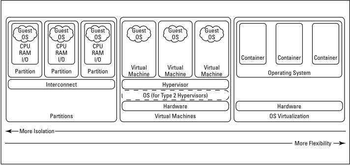

# Server Virtualization Technologies

Editors: **Kaan Keskin**

Date: March 2022

Available at: https://github.com/kaan-keskin/software-development-life-cycle-and-cloud-native-concepts

**Resources:**

> - Virtualization Essentials - Matthew Portnoy
> - Server Virtualization For Dummies - Lawrence C. Miller
> - Wikipedia - www.wikipedia.com

**LEGAL NOTICE: This document is created for educational purposes, and it can not be used for any commercial intentions. If you find this document useful in any means please support the original authors for ethical reasons.**

## What Is Virtualization?

Virtualization technology emulates real — or physical — computing resources, such as desktop computers and servers, processors and memory, storage systems, networking, and individual applications. Server virtualization creates “virtual environments” that allow multiple applications or server workloads to run on one computer, as if each has its own private computer.

A hypervisor — also known as a virtual machine manager (VMM) — allows multiple “guest” operating systems to run concurrently on a single physical host computer. The hypervisor functions between the computer operating system (OS) and the hardware kernel.

The kernel was known as the supervisor in mainframes; hence the term hypervisor was coined for the software operating above the supervisor.

Two types of hypervisors are defined for server virtualization: Type 1 and Type 2.

- A Type 1 hypervisor, also known as a native or bare metal hypervisor, runs directly on the host computer’s hardware.
- A Type 2 hypervisor, also known as a hosted hypervisor, runs within an operating system environment (OSE).

## Why Virtualize?

Enterprise business requirements are driving a rapidly evolving technology landscape in which:

- Enterprises need greater optimization and efficiency beyond simple consolidation and provisioning of systems.
- Data centers are becoming “service centers” that must deliver applications on demand and respond to changing customer requirements with speed and flexibility.
- Cloud computing necessitates full stack, integrated application provisioning and management in order to provide users with access to services at any time and from anywhere.

Virtualization is a key technology used in data centers to optimize resources. Many companies start their server virtualization journey by consolidating systems to reduce capital expenditures (CAPEX). By focusing their virtualization initiatives on consolidating underutilized resources, many organizations are able to:

- Lower their operating expenses (OPEX), such as energy costs.
- Reduce their data center — and carbon — footprint.
- Save on capital expenditures for new server equipment.
- Provision new systems faster by building standard server operating system images.

This strategy works well for file, print, and web server consolidation, where high availability and scalability requirements are often less stringent than for other critical business systems. But too often, such a strategy is limited by its narrow focus on the operating system layer, and therefore lacks integration with applications and other software running in virtual environments.

But as enterprise IT needs continue to evolve toward on-demand services, data center virtualization requirements have gone well beyond simple consolidation and CAPEX reduction. IT departments must find better ways to integrate, provision, deploy, and manage systems — at a faster pace — without further straining already tight budgets. Greater optimization and efficiency is needed in how software and solutions that power data centers are deployed and managed.

Enterprise users have also become less tolerant of traditional “build-it-yourself” approaches to technology services — simply provisioning and delivering an operating environment falls short. Instead, they expect resources on demand, right when they need them. To satisfy their users’ ever-growing appetite for information and services, IT organizations must rapidly deliver services on demand, such as infrastructure-as-a-service (IaaS), platform-as-a-service (PaaS), and software-as-a-service (SaaS). Everything simply must work together reliably and securely — and always faster!

As a result, virtualization solutions need to mature and facilitate flexibility, agility, and speed in deploying complete application stacks to support the new services-based charter. Traditional virtualization technologies with isolated hypervisors at the operating system level are no longer sufficient to meet business needs.

Virtualization is not a goal by itself. Virtualization is a means to the strategic goal of enabling services-based IT in the enterprise. It is a journey — not a destination.

## Exploring Use Cases

In order to realize the business benefits of virtualization (discussed in Chapter 1), you need to understand the various use cases that are appropriate for specific scenarios within your data center. In the following sections, you learn about seven common use cases for server virtualization.

### Consolidated workloads

The trend within the software industry to design enterprise applications that run on dedicated, purpose-built servers for maximum performance and stability has led to server sprawl in the data center. Virtualization technology allows enterprises to consolidate multiple, often unrelated workloads from multiple servers to a single physical server, running multiple virtual environments (VEs).

In virtualization, workload is generally used to describe the operating system and application components of a physical server or host.

Virtualization allows multiple applications to be run on a single physical server in different VEs, creating the effect of a purpose-built server for each of the applications running on the server. This approach avoids potential interoperability issues between applications running in a mixed environment.

### Asynchronous workloads

Many enterprise workloads are active at certain times during a typical day, but use few system resources at other times. For example, an organization’s customer relationship management (CRM) system may see heavy use during normal business hours, but their enterprise resource planning (ERP) system may not peak until the second and third shifts in its distribution center. Peak utilization for each of these systems may require as much as 60 to 80 percent of server resources (typically processor and memory), but the average utilization may be less than 30 percent for each system.

Virtualization allows you to take advantage of these asynchronous workloads by combining both systems on a single physical server to maximize the overall utilization of the physical server. Virtualization technologies such as resource controls, resource scheduling, and VE migrations can be used to help you prevent resource contention issues.

### Bursty workloads

Many workloads are characterized by bursts of intense activity, followed by periods of little or no activity.

For example, software developers typically require lots of processing and memory resources while compiling new software code. For this reason, developers often use very powerful computers to do their work. But most of the time, their computer resources are relatively idle, and those same software developers instead require lots of highly caffeinated liquid resources!

Virtualization allows multiple developers to use the same hardware resources. You can build one VE and allocate the appropriate computing resources, then allow each of your developers to connect remotely in order to compile code in turn, as needed.

### Relieving scalability constraints

Scalability is always a concern for IT staff when deploying new systems or upgrading existing systems. When you purchase computer equipment — particularly servers — you must anticipate your organization’s future growth and user demand. You also must estimate the maximum resource capacity (such as processors, memory, and storage) that will be needed over the life of the system — typically five to seven years. These complex and sophisticated calculations produce a very precise SWAG — a scientific, academic guess. And the typical result of many SWAGs is that businesses purchase systems that are too expensive and too large (in terms of capacity), hoping they will not outgrow their investment too quickly.

Inevitably:

- A new server will initially have excess capacity and therefore be underutilized. Given the general trend that computer hardware costs drop dramatically with each successive technology improvement (such as processor speed), you will almost certainly pay too much for excess capacity far in advance of when you actually need it — and the cost of that same technology will have fallen significantly by the time you need it!
- The workload will eventually outgrow the resource capacity of the server — whether due to business growth, greater user demand, software upgrades, or server obsolescence. When that happens, the entire cycle repeats itself, beginning with yet another SWAG! The operating system and application will then need to be re-installed and configured on the new server — a time-consuming and often error-prone process.

With virtualization, an enterprise can purchase and deploy many smaller servers, then just simply migrate a VE workload to a larger server when it outgrows its original server.

Alternatively, an enterprise can purchase fewer larger servers and install multiple VE workloads on each server to fully utilize its total capacity. When a workload’s resource requirements exceed the capacity of the host server, you can either migrate the VE to a different server, or migrate other VE’s to a different server to free additional resources on the server.

Migration is the process of moving a VE from one physical server to another. This operation is possible because of the separation (or containment) that virtualization technology creates between a workload and its server hardware.

### Simplified workload mobility

Workload mobility enables you to:

- Perform hardware maintenance or upgrades while minimizing costly downtime by simply moving your VEs to another physical host server while you replace a faulty power supply or add memory in the original host server, for example.
- Proactively manage server resources by automatically migrating unusually busy workloads to less busy physical hosts.
- Maintain business continuity when an outage or disaster occurs by moving workloads to other physical hosts within a data center (for example, to circumvent an isolated outage), or between data centers (for example, in the event of a wide-spread disaster).

Three migration types are defined for virtualization technology: cold, warm, and live. Each migration type is characterized by the amount of time during which the workload is not available, and by the amount of workload state (for example, active sessions or open transactions) that is lost during the migration process.

See Table below for a summary of the differences between these migration types.

| Type | Outage Duration | Stateful Transfer |
| --- | --- | --- |
| Cold | minutes to hours | No |
| Warm | Tens of seconds | Yes |
| Live | Less than one second | Yes |

The cold migration process requires the following three steps:
1. Orderly halting of the original physical host and its workload(s).
2. Transfer of data files from the old storage to new storage, or reconfiguration of shared storage.
3. Start-up on the new physical host and the migrated workloads.

P2V and V2V conversions are two common examples of cold migrations. A P2V (physical-to-virtual) conversion involves converting an existing physical server workload to a virtual environment (VE) on a host server. A V2V (virtual-to-virtual) conversion involves converting servers and their associated workloads from one virtualization technology to another.

V2P (virtual-to-physical) conversions, while uncommon, are also possible. For example, after virtualizing a mission-critical online transaction processing (OLTP) application, you may discover that the performance of the virtualized system is unsatisfactory.

A warm migration does not require halting and rebooting of the VE. Unlike a cold migration, active processes on the VE are not shut down during a warm migration, so current state information is maintained. However, a warm migration requires a noticeable service outage, usually on the order of tens of seconds. During that time, the virtualization technology performs the following three steps:

1. Pauses the VE and its processes on the original system.
2. Creates a copy of the VE on the destination (or target) system.
3. Copies a memory image of the related processes from the original VE to the new VE.

The VE processes then continue their execution on the target system and the original memory image is erased.

Similar to a warm migration, a live migration does not require halting and rebooting of the VE. But unlike a warm migration, the service outage associated with a live migration is too short (usually less than one second) for most users to notice and any applications running on the VE are not affected by the outage. The live migration method performs these four steps:

1. Creates a copy of the VE on the destination (or target) system while the VE is still running.
2. Copies a memory image of the related processes from the original VE to the new VE.
3. Pauses the VE and its processes on the original system and transfers a final set of data to the new VE.
4. Passes control of the VE from the original system to the new system.

### Flexible, rapid provisioning

Provisioning traditional systems is an expensive and time-consuming process for any organization, which can take days or weeks. Virtualization tools provide IT organizations with a rapid, flexible provisioning capability to support their enterprise requirements. Because virtualized OS environments have a very small disk footprint, IT staff can easily create and clone master OS images for use in virtually any deployment scenario.

Provisioning a new system with virtualization tools takes minutes instead of days and simply involves selecting and fine-tuning (for example, configuring a system name and IP address) the appropriate OS image, then booting it up on the new host server!

### Testing and staging

Many test environments are configured for a specific purpose, for example to test a new application or a modification to an existing application. But these test environments are often underutilized because testing is not typically performed every day or on a regular basis.

Most functional testing of systems and applications can be performed today in a virtualized environment without significantly affecting the outcome of the tests. This allows organizations to consolidate their testing environments and run individual tests on separate VEs. VEs can be quickly provisioned and configured to test specifications and easily decommissioned or re-purposed when the test is concluded.

Virtualization is best used for functional testing rather than performance or scalability testing. Performance testing in virtualized environments is appropriate only if the production workload will be deployed in a VE.

## Understanding System Virtualization Models

Three models for system virtualization are commonly used: hardware partitioning, virtual machines, and operating system (OS) virtualization. Each model can be described in terms of two characteristics that have an inverse relationship — flexibility and isolation. Typically, as more isolation is required between VEs, less flexibility is provided in resource allocation. Conversely, flexibility requires resource sharing, which reduces isolation between VEs.

Flexibility versus isolation in system virtualization models.

### Hardware partitioning

Hardware partitions offer the most isolation but the least flexibility. Hardware partitioning ensures complete electrical segregation of computer hardware resources — CPUs, RAM, and I/O components — to create multiple independent computers within one computer. Each isolated grouping of hardware is called a partition or domain.

A partition runs its own copy of an operating system and has complete control over its hardware. The OS runs directly on the hardware just as in a traditional physical (nonvirtualized) environment. However, any single failure — whether in hardware or software — in a component of one VE cannot affect another VE in the same physical server.

Partitions are most appropriate for business-critical workloads where service availability is the most important factor.

### Virtual machines

The most popular virtualization model is the virtual machine. This model mimics multiple servers or workloads — virtual environments (VEs) — on a single physical (or host) system, each running its own OS. Each of these VEs is called a virtual machine. Virtual OS instances are managed by software or firmware — or a combination of both — which also provides multiplexed access to the hardware. This supporting layer of firmware/software — the hypervisor — gives this model its flexibility, but also adds performance overhead while performing its various virtualization functions.

Fault isolation varies among different implementations of hypervisors. Each shared resource in the virtual machine model is a potential single point of failure, including the hypervisor itself.

Virtual machines typically represent a middle ground between the isolation of hard partitions and the flexibility of operating system virtualization, or OSV. The additional isolation of separate OS instances compared to OSV allows for the consolidation of completely different operating systems. The hypervisor layer also provides a convenient point of separation between VEs, thereby facilitating and simplifying VE mobility.

### Operating System Virtualization (OSV)

The ability to provide multiple isolated execution environments in one operating system (OS) instance is called operating system virtualization (OSV).

Hardware partitioning and virtual machine technologies share a common trait: Each VE contains an instance of an operating system. Most of those technologies allow different operating systems to run concurrently.

In contrast, operating system virtualizations, also known as zones or containers, use features of the operating system to create VEs that are not separate copies of an operating system. This approach provides the appearance of an individual operating system instance for each VE. Most OSV implementations provide the same OS types as the hosting OS. 

Among the virtualization models, OSVs provide the maximum flexibility but the least isolation between VEs. Isolation in OSVs is enforced by the OS kernel, rather than by a hypervisor (as in VMs) or hardware (as in partitions). All processes share the same OS kernel, which must provide a robust mechanism to prevent two different VEs from interacting directly. Without this isolation, one VE could affect the operation of another VE. The kernel must be modified so that the typical inter-process communication (IPC) mechanisms do not work between processes in different VEs.

OSV implementations usually require little disk space, consume minimal RAM, and add very little CPU overhead.

System virtualization models include hardware partitioning, virtual machines, and operating system (OS) virtualization.
