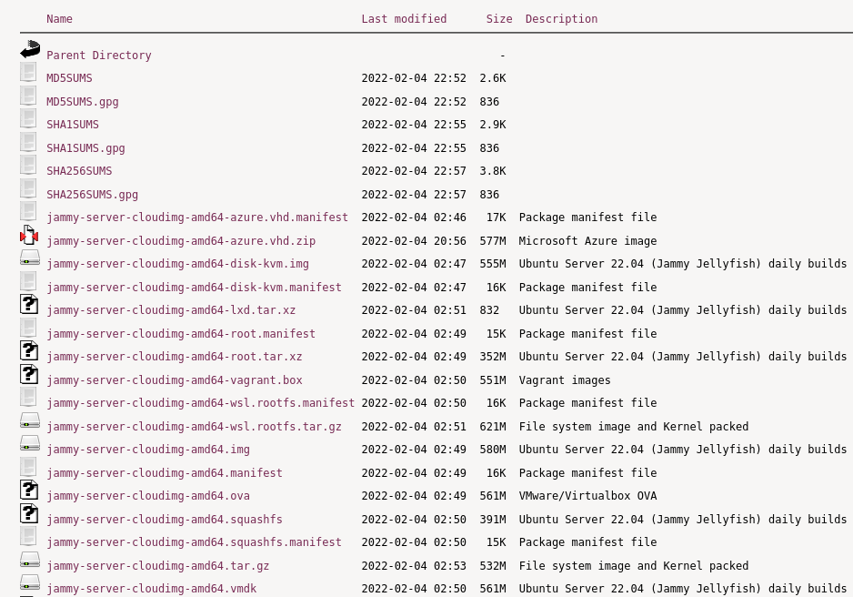

# Virtualization Technologies and Cloud OS Alternatives

## What Is Virtualization?

Virtualization technology emulates real — or physical — computing resources, such as desktop computers and servers, processors and memory, storage systems, networking, and individual applications. Server virtualization creates “virtual environments” that allow multiple applications or server workloads to run on one computer, as if each has its own private computer.

A hypervisor — also known as a virtual machine manager (VMM) — allows multiple “guest” operating systems to run concurrently on a single physical host computer. The hypervisor functions between the computer operating system (OS) and the hardware kernel.

The kernel was known as the supervisor in mainframes; hence the term hypervisor was coined for the software operating above the supervisor.

Two types of hypervisors are defined for server virtualization: Type 1 and Type 2. 
- A Type 1 hypervisor, also known as a native or bare metal hypervisor, runs directly on the host computer’s hardware. 
- A Type 2 hypervisor, also known as a hosted hypervisor, runs within an operating system environment (OSE).

## Why Virtualize?

Enterprise business requirements are driving a rapidly evolving technology landscape in which:

- Enterprises need greater optimization and efficiency beyond simple consolidation and provisioning of systems.
- Data centers are becoming “service centers” that must deliver applications on demand and respond to changing customer requirements with speed and flexibility.
- Cloud computing necessitates full stack, integrated application provisioning and management in order to provide users with access to services at any time and from anywhere.

Virtualization is a key technology used in data centers to optimize resources. Many companies start their server virtualization journey by consolidating systems to reduce capital expenditures (CAPEX). By focusing their virtualization initiatives on consolidating underutilized resources, many organizations are able to:

- Lower their operating expenses (OPEX), such as energy costs.
- Reduce their data center — and carbon — footprint.
- Save on capital expenditures for new server equipment.
- Provision new systems faster by building standard server operating system images.

This strategy works well for file, print, and web server consolidation, where high availability and scalability requirements are often less stringent than for other critical business systems. But too often, such a strategy is limited by its narrow focus on the operating system layer, and therefore lacks integration with applications and other software running in virtual environments.

But as enterprise IT needs continue to evolve toward on-demand services, data center virtualization requirements have gone well beyond simple consolidation and CAPEX reduction. IT departments must find better ways to integrate, provision, deploy, and manage systems — at a faster pace — without further straining already tight budgets. Greater optimization and efficiency is needed in how software and solutions that power data centers are deployed and managed.

Enterprise users have also become less tolerant of traditional “build-it-yourself” approaches to technology services — simply provisioning and delivering an operating environment falls short. Instead, they expect resources on demand, right when they need them. To satisfy their users’ ever-growing appetite for information and services, IT organizations must rapidly deliver services on demand, such as infrastructure-as-a-service (IaaS), platform-as-a-service (PaaS), and software-as-a-service (SaaS). Everything simply must work together reliably and securely — and always faster!

As a result, virtualization solutions need to mature and facilitate flexibility, agility, and speed in deploying complete application stacks to support the new services-based charter. Traditional virtualization technologies with isolated hypervisors at the operating system level are no longer sufficient to meet business needs.

Virtualization is not a goal by itself. Virtualization is a means to the strategic goal of enabling services-based IT in the enterprise. It is a journey — not a destination.

## Virtualization Technologies

Virtualization is being adopted in many different environments and situations. If you are a developer, virtualization can provide you with a contained environment where you can safely do almost any sort of development safe from messing up your main working environment. If you are a systems administrator, you can use virtualization to more easily separate your services and move them around based on demand.

The default virtualization technology supported in Ubuntu is KVM. For Intel and AMD hardware KVM requires virtualization extensions. But KVM is also available for IBM Z and LinuxONE, IBM POWER as well as for ARM64.
Qemu is part of the KVM experience being the userspace backend for it, but it also can be used for hardware without virtualization extensions by using its TCG mode.

While virtualization is in many ways similar to containers those are different and implemented via other solutions like LXD, systemd-nspawn, containerd and others.

### Qemu

Qemu is a machine emulator that can run operating systems and programs for one machine on a different machine. Mostly it is not used as emulator but as virtualizer in collaboration with KVM kernel components. In that case it utilizes the virtualization technology of the hardware to virtualize guests.

While qemu has a command line interface and a monitor to interact with running guests those is rarely used that way for other means than development purposes. Libvirt provides an abstraction from specific versions and hypervisors and encapsulates some workarounds and best practices.

## VM Linux OS Alternatives

- Ubuntu Cloud Images
- CoreOS

### Ubuntu Cloud Images

**Ubuntu Cloud Images** are the official Ubuntu images that have been customised by Canonical to run on public clouds that provide Ubuntu Certified Images, Openstack, LXD and more.

Canonical produces a variety of cloud-specific images, which are available directly on the cloud’s themselves as well as on https://cloud-images.ubuntu.com.

#### Private Clouds

On cloud-images.ubuntu.com, users can find standard and minimal images for the following:

    Hyper-V
    KVM
    OpenStack
    Vagrant
    VMware

#### Release Support

Cloud images are published and supported throughout the lifecycle of an Ubuntu release. During this time images can receive all published security updates and bug fixes.

For users wanting to upgrade from one release to the next, the recommended path is to launch a new image with the desired release and then migrate whatever workload or data to the new image.

Some cloud image customization must be applied during image creation, these would be missing if an in-place upgrade were performed. For that reason in-place upgrades of cloud images are not recommended.

### Customising Cloud Instances

#### cloud-init

Cloud images are operating system templates and every instance starts out as an identical clone of every other instance. It is the user data that gives every cloud instance its personality and cloud-init is the tool that applies user data to your instances automatically.

Use cloud-init to configure:
- Setting a default locale
- Setting the hostname
- Generating and setting up SSH private keys
- Setting up ephemeral mount points 

#### Works with many popular operating systems

While cloud-init started life in Ubuntu, it is now available for most major Linux and FreeBSD operating systems. For cloud image providers, then cloud-init handles many of the differences between cloud vendors automatically — for example, the official Ubuntu cloud images are identical across all public and private clouds.

